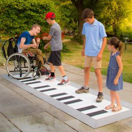

# Coding 作為創作工具的特性
> 2024/02/28

> 這篇文章不會討論新媒體藝術、科技藝術的範疇，及其背後的美學脈絡、價值，而是會以介紹 Coding(寫程式)作為一種創作的媒介、實踐手段，具備怎樣的優點。期望能以此減少藝術與科技間的鴻溝，促發更多跨域討論的機會。

###  前言: 我們能如何運用Coding創作
我認為只要創作過程中涉及到「數位」都能夠運用到，除了最直覺聯想到的結合攝影機、感測器、鍵盤滑鼠創作「互動藝術」和「遊戲」外，影像編輯、特效、3D建模、音樂視覺化、VR都是很常見的應用。更廣泛來說，即便是雕塑、繪畫等較為傳統的類比媒材，也能將程式作為輔助創作的工具。隨著程式撰寫經驗的增加，觀賞更多作品後，對於程式和藝術間的想像力也會逐漸加深，產出新的點子。

### 可閱讀/分析性
程式碼和繪畫很大的差異在於，它是以「文字」作為載體，除了要符合規範，能夠被電腦順利執性外，也需要考慮到將來增加功能、除錯的方便，而必須具備一定的「可閱讀性」，這種特性除了對於修改、版本控制[^1]很方便，也讓我們很容易根據一件作品的程式碼分析創作者背後的思考架構，進而模仿、學習、改編。這是繪畫、雕塑相較下更難做到的。

### 開源性
深受開源文化、駭客文化的影響，許多數位藝術家深信資訊自由的理念，會免費將作品背後的原始碼、設計的工具全部公開到網路上供他人學習，改良，這種氛圍也能讓整體文化迭代更快速。同時也為大家創造了除了商業軟體外的選擇，例如可以使用GIMP而不用花大錢買PhotoShop，或冒著風險載快樂版軟體。

### 自行開發工具
「媒介即訊息」是由麥克漢魯所提出的概念，媒介(技術)的發展延伸了我們的感官經驗，塑造不同認知世界的方法。[^2]媒介並非只是傳達訊息的機器，媒介本身也是訊息的一部分。過去的藝術家會不斷摸索媒材的特性、設計輔助工具(玻璃透鏡、暗箱)，然而隨著資本主義的興起，專業分工成為常態，創作者們開發其他媒材的能力、意願降低，畢竟，已經有跑車，誰還要去學怎麼造輪子? 用程式創作的好處在於，開車技術也可以拿來造輪子，擁有「自行開發工具、媒介」的能力，不受困於既有創作工具的思考模式 (ex 剪輯軟體的操作邏輯)、現存媒介的限制。此外，也可以用來提升創作過程的流暢、便利性。

> *「身為一個有撰寫程式能力的創作者，面對一個有開發空間的工具，擁有許多摸索、開發、改良，甚至創造新功能的可能，並進而讓創作更貼近理想。當他在創作狀態時，有想要建構的畫面或是內容，但功能上卻還無法達成時，他便轉為開發者，試圖讓工作流程更順暢，甚至開發新的功能去回應需求。隨著開發過程的進展，也可能在其中試出新的效果，並進一步構想可以發展的不同段落或是支線。」  -- 擷取自clabo訪談李亦凡[^3]* 

### 跨媒介整合
影視、戲劇配樂是很好的例子，不過這邊更想談的是一種「資料在不同媒介中轉換呈現」的概念，聽起來有一點抽象，附上示意圖以及幾個簡單的例子:

任何事物都可以是一個資料(data)，像是表情，肢體運動幅度大小，聲音高低，顏色，甚至是連接網路的公開資料(像是氣溫、Google熱度關鍵字、人口變化、開啟社群媒體次數)......，我們可以把這些資料互相對應(mapping)，例如:

1. **資料視覺化/聲音化**
    絕不只是讓數字更容易被理解，也涉及怎麼詮釋數字/資料、如何連結現實世界。
    <iframe width="800" height="400" src="https://www.youtube.com/embed/6aLjk0Zs5Vc?si=TsL_LedDDdoZCWfP&amp;start=40" title="YouTube video player" frameborder="0" allow="accelerometer; autoplay; clipboard-write; encrypted-media; gyroscope; picture-in-picture; web-share" allowfullscreen></iframe>    
    
     
    
    *<時間之花> by藝術家 李炳曄老師*

    
    將一週的抱怨次數轉成音符和圖表 [圖片來源](http://www.dear-data.com/theproject)

2. **動作視覺化**，並同時將線條轉成音高播放。以下案例是google creative lab的專案，可點擊連結試玩
    https://experiments.withgoogle.com/sound-canvas
    <iframe width="600" height="400" src="https://lh3.googleusercontent.com/B7OBFFbwDCMaC4Z5CyiMGYen5SIRfHVKG2k1APhj9E5eLNViKATnJ2lLa8V1anw4-Aj4zlpUlsn9owflx6QTe1pELInZCQ" style="width=450px; height=300px"></iframe>
       

   
3. **動作與聲音**

    |||
    |:-:|:-:|
    |特雷門琴|用腳觸發鋼琴|
    
    雖然這兩個範例都仰賴實體裝置，但也可以透過電腦鏡頭偵測你的動作觸發音高，設計發出聲音的不同方式，而不只是如傳統樂器以「手」為主。動作的同時也可以設計觸發現場的燈光、噴霧等等。

印刷術的出現雖造就了文藝復興，卻也讓我們感知外在的方式變得越來越不平衡，過度依賴視覺(文字、影像)來認識世界和想像抽象的概念(時間、遺憾、情感...)。計算機及電子設備的進展則提供了回應該現象的可行性，重新整合感官間的平衡，將味覺、聽覺、視覺、肢體動作連結起來，打破當今思想與身體的分離、五官不平衡的情況。

### 小結
我認為藝術與程式間的結合不只是所謂「冷冰冰的機械美感」、「為跨領域而跨」、「晦澀難懂」。當代藝術中對於現實世界的種種反思(倫理、政治經濟、生態)能夠幫助社會更加有感於科學發現、人文思考，引起對於「我們該何去何從」的討論；科技的革新除帶來更多樣的表現形式，也迫使藝術的本質必須得被不斷質疑(AI的出現即為一例)。兩者並非對立，透過跨學科間的互動，我們得以建立起對現實更全貌、多樣的理解。而第一步正是打破彼此的刻板印像與製造對話的空間，也是撰寫本文的核心目的。

### 延伸學習資源
1. 個人推薦選擇Python或JavaScript 作為初學者學習的程式語言，可透過網路查資源、自學實作一些小遊戲、小專案來理解程式。或是也蠻推薦[互動藝術程式創作入門](# 互動藝術程式創作入門)這門HAHOW上的線上課的。
2. [《美學程式運算》](https://openhumanitiespress.org/books/download/Soon-Cox_2020_Aesthetic-Programming.pdf)
	一本由工程師、藝術家、策展人所寫的書，以p5.js作為範例。完全開源免費，可以點擊該網址打開線上中文翻譯版。
	

[^1]:試想你正在寫一首詩，寫了幾個段落，不滿意刪掉後又增加了幾個段落，刪刪改改。突然，你想找回之前的某一個版本該怎麼做? 版本控制即是為此而生的工具，它能夠輕易地比較出版本間的差異，復原不同版本，方便多人協作，非常適合「文字檔」(不限於程式碼)的編輯。有興趣者可以用git, github為關鍵字查詢。
[^2]: 劉育成(2016年5月) 。科技中介的去感官同步化體驗： VR 藝術裝置初探。現代美術學報，45。40-60。
	 https://map.tfam.museum/journal/list/JO0045
     
[^3]: 馮馨(2022.03.23) 。為自己量身打造一款更直覺的數位創作工具，談李亦凡「瘋狂影像工具」。
	https://mag.clab.org.tw/clabo-article/toolkit-of-madness/
    

